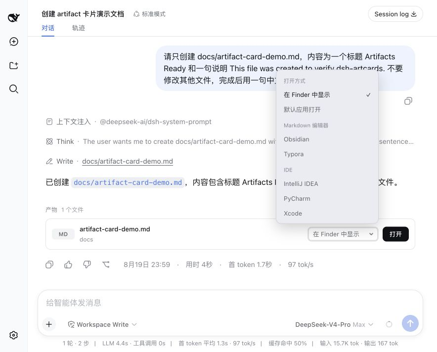

# dsh-artcards

Adds artifact cards to DeepSeek Harness (DSH) Web.

When a conversation creates or modifies files, the plugin shows their names, types, and directories below the response. It can:

- reveal files in Finder or a file manager;
- open files with the default application;
- open files with an installed Markdown editor or IDE on macOS.

## Preview



## Install

DeepSeek Harness, Node.js 22 or newer, and the DSH `web` profile are required.

Run from the project directory:

```bash
./install.sh
```

Restart DSH after installation:

```bash
dsh web
```

## Use

Run a DSH Web task that creates or modifies a file. Artifact cards will appear below the completed response.

Click a file name to use the default DSH file action, or select Finder, the default application, or a detected local editor and click **Open**.

## Uninstall

Run from the project directory:

```bash
./uninstall.sh
```

Restart `dsh web` after removal.

## Notes

- Verified on macOS with DeepSeek Harness `0.1.0-rc.7` and Node.js 24.
- Native file actions require DSH Web to be accessed through a local loopback address.
- See [INSTALL.md](INSTALL.md) for installation details and troubleshooting.

## License

MIT
